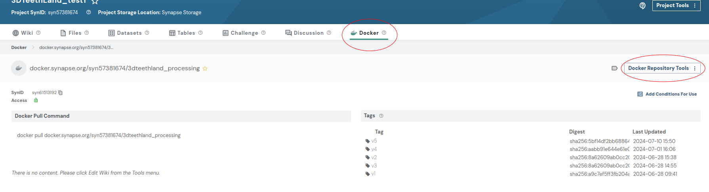
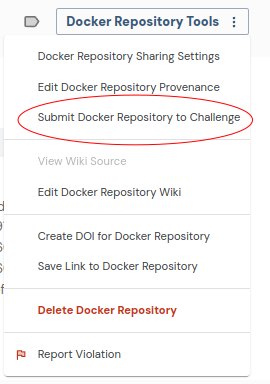

# Docker image of reference algorithm for 3DTeethLand-MICCAI 2024 challenge .

## 1. Create a Synapse Project for submission
Firstly, you will need to create a Synapse Project that will allow you to participate with your submission.
You can do this easily by signing in to your Synapse account, going to the Projects tab to the left and creating a new project.

We recommend to name your project as 

```bash
3DTeethLand-MICCAI2024 <Your team name>
```

By default, all Synapse projects are private and only accessible to the creator.
If you are participating as part of a submission team, share the project with your team so that all team members can upload and submit from the project. 
To share, click on Project Tools followed by Project Sharing Settings. Add your team members under "Add More People".

## 2. Build your model

We encourage you to adapt this example to your needs and your 3D teeth landmarks detection and solution.
You can modify, remove, or add the the files as needed and customize your parameters.
As discussed above, the main python script to be run by the container is process.py. Please note that we hightlighted the most relevant code parts to be customized with TODO comments.

### 2.1 Input and Output interfaces

Participants are required to develop an algorithm that processes 3D **.obj** scan files mounted in the /input directory. 
The algorithm should iterate over all these scans and load each mesh using the **trimesh** package.

The output should be a **CSV** file named **predictions.csv** located in the /output directory. 
This file should contain the following columns:

- **key:** The name of the scan file.
- **coord_x:** The x-coordinate of the detected landmark.
- **coord_y:** The y-coordinate of the detected landmark.
- **coord_z:** The z-coordinate of the detected landmark.
- **class:** The class of the landmark, which should be one of the predefined classes in `LANDMARKS_CLASS` ("Mesial", "Distal", "Cusp", "InnerPoint", "OuterPoint", "FacialPoint").
- **score:** A prediction likelihood score between 0 and 1.

Here is an example of the expected format for the predictions.csv file:
```csv
key,coord_x,coord_y,coord_z,class,score
014JUMCF_upper,2.964,-17.679,-82.792,Mesial,0.113
014JUMCF_upper,2.298,-18.874,-83.570,Mesial,0.943
014JUMCF_upper,9.833,-15.613,-82.974,Distal,0.290
014JUMCF_upper,13.990,-10.190,-83.462,Distal,0.919
014JUMCF_upper,25.974,2.418,-89.593,OuterPoint,0.637
014JUMCF_upper,28.640,11.526,-91.907,OuterPoint,0.361
```
### 2.2 Configure Dockerfile

We recommend that you use our dockerfile as a template, and update it according to your algorithm requirements. There are three main components you need to define in your docker file in order to wrap your algorithm in a docker container:

- Choose the right base image (official base image from the library you need (tensorflow, pytorch etc.) recommended)
```python
FROM pytorch/pytorch:1.9.0-cuda11.1-cudnn8-runtime
```

- Copy all the files you need to run your model : model weights, requirements.txt, all the python files you need etc.
```python
COPY . .
```

- Install all the dependencies, defined in requirements.txt, in your dockerfile.
```python
RUN python -m pip install --user -rrequirements.txt
```

Ensure that all of the dependencies with their versions are specified in requirements.txt

### 2.3 Build and Test docker

- **Build:** To test if all dependencies are met, you should run the file **build.sh** (Linux) to build the docker container. 
- Please note that the next step (testing the container) also runs a build, so this step is not mandatory if you are certain that everything is set up correctly.

- **Test:** To ckeck if your docker container works as you expect, you may run locally **test.sh**. 
But first you need to update the file output/expected_output.csv with your expected results (output of your algorithm) for the tested sample input/014JUMCF_upper.obj. test.sh actually runs your docker image on input/014JUMCF_upper.obj, produces /output/predictions.csv, and finally compares it to output/expected_output.csv.

If the test runs successfully you will see the message Tests successfully passed... at the end of the output

### 2.4 Upload your docker image-
First, log in to your Synapse account:

```bash
docker login -u <YourUsername> -p <YourPassword> docker.synapse.org
```

To tag and push a Docker image to Synapse, you can use the following script. This script takes the Synapse Project ID, Image name, and Tag as arguments to tag the Docker image and push it to Synapse.

Arguments:

* -p "Project ID": The Synapse ID of your project.
* -i "Image name": The name you want to give the image. It should be 2 to 255 characters long, and can only contain lowercase letters, numbers, -, and _. This name must also be unique within your project.
* -t "Tag": The tag for the image. If no tag is specified, a latest tag is added to your image. Tagging your image is very helpful, as it allows you to build different versions of your Docker image.

Example Usage:
To tag and push a Docker image named **my-model** into the **syn1234567** Synapse project with the tag **v1.0**, you would run:

```bash
sh export.sh -p syn1234567 -i my-model -t v1.0
```

## 3. Submit your docker
Go to the Docker tab on your Synapse Project webpage. There, you will see the docker file you just pushed.



Select it and click on Docker Repository Tools. Select Submit to Challenge.



Here, you will need to indicate which challenge you're submitting to. You can also give a name to your submission (recommended, since this makes it easier to find the logs associated to your submission).

Then, you can indicate whether you're submitting as a team or as an individual. If you're submitting as a team, remember to first Register your team on the challenge webpage.

Once you confirm, the pipeline will run. You will receive an email indicating if it ran successfully and a link where you will be able to see the logs of the execution and the evaluation result over one random train case. This will allow you to corroborate that the model runs correctly over one volume.

